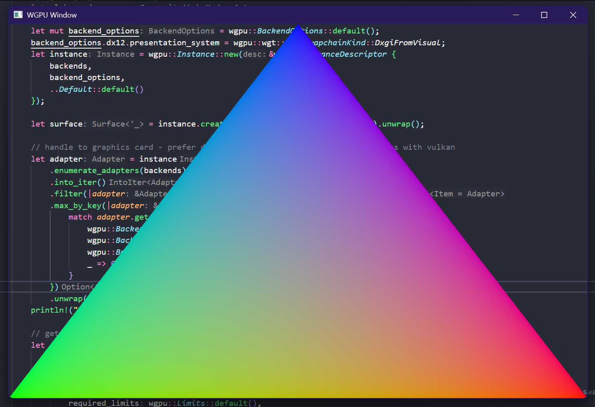

# WGPU Portable Transparency Example
Simple example showing how to do transparency with WGPU.

## Works on
- Windows (DX12 backend(Premultiplied alpha))
- MacOS (Metal backend(Postmultiplied alpha))
- Linux (Vulkan backend(Premultiplied alpha))

## Issues
- Vulken backend on windows only shows opaque as alpha option
- Winit has an issue with background not being cleared on windows - fix on branch here https://github.com/n1ght-hunter/winit/commit/06bf39cfac97811d4fde79578dfa81ab76004cfc

